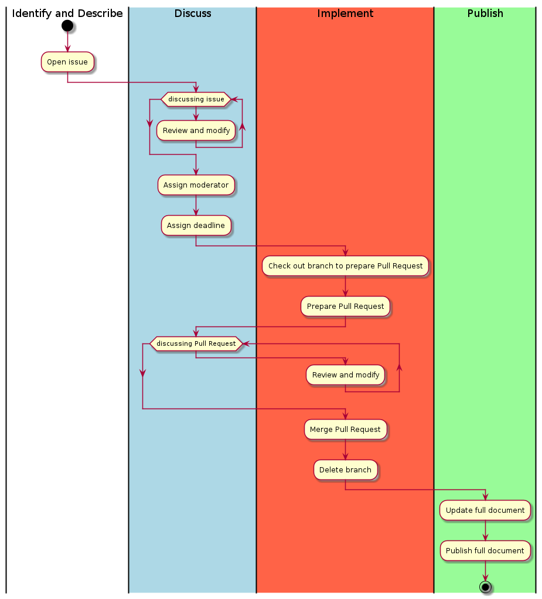

[![CC BY 4.0][cc-by-shield]][cc-by]
# Data architecture description for Virtual Access in the POLARIN project
This repository documents the data architecture for Virtual Access (VA) within the POLARIN project. This is the Architecture Design Document (ADD) and it is based on a similar document developed for the Svalbard Integrated Arctic Earth Observing System (SIOS) Data Management System. Documents are added as ASCIIDOC and diagrams as PlantUML. Both need post-processing into HTML/PDF and PNG respectively.

| NOTE: This repository is a work in progress. Even though the repository is prepared to host a full ADD, this is not done yet. For now it is merely a collection of diagrams that are useful for discussion.

## Intended audience
The intended audience of this repository are the POLARIN project partners, and in particular the work package (WP) 4 and 5 team members. The repository is also open to the public, and anyone interested in the data architecture of Virtual Access in POLARIN is welcome to read and comment on the content.

## Contributing to this document
It is assumed that editing of document/diagrams is done by a limited group of people, while others pose comments and requirements through GitHub issues.

If you want to contribute to the contents of this repository, please do so according to the following guidelines: open an issue here on GitHub, make changes to a new branch and make a pull request. If you are not comfortable with this approach, please [email us](mailto:polarin@sios-svalbard.org) to request changes! 

## The POLARIN project 
POLARIN is a EU-HORIZON2020 project that compiles an international network of polar research infrastructures and their services, aiming at addressing the scientific challenges of the polar regions. The network includes a wide array of complementary and interdisciplinary top level research infrastructures: Arctic and Antarctic research stations, research vessels and icebreakers operating at both poles, observatories, data infrastructures and ice and sediment core repositories.

POLARIN will provide integrated, challenge-driven, and combined access to these infrastructures to facilitate interdisciplinary research on complex processes.
POLARIN has the following six specific objectives, coherent with the work packages, each with measurable outcomes:

- Enable science for understanding and predicting key processes in polar regions.
- Provide efficient challenge-driven transnational access (TA) to top level RIs in the polar regions.
- Improve data services and provide customised data products.
- Provide virtual access (VA) to data and data services.
- Provide training for infrastructure users.
- Advertise RI services and engage RI users. 

Want to learn more about the POLARIN project? Go to the [project website](https://eu-polarin.eu/).

## License
This work is licensed under a [Creative Commons Attribution 4.0 International
License][cc-by].

[![CC BY 4.0][cc-by-image]][cc-by]

[cc-by]: http://creativecommons.org/licenses/by/4.0/
[cc-by-image]: https://i.creativecommons.org/l/by/4.0/88x31.png
[cc-by-shield]: https://img.shields.io/badge/License-CC%20BY%204.0-lightgrey.svg