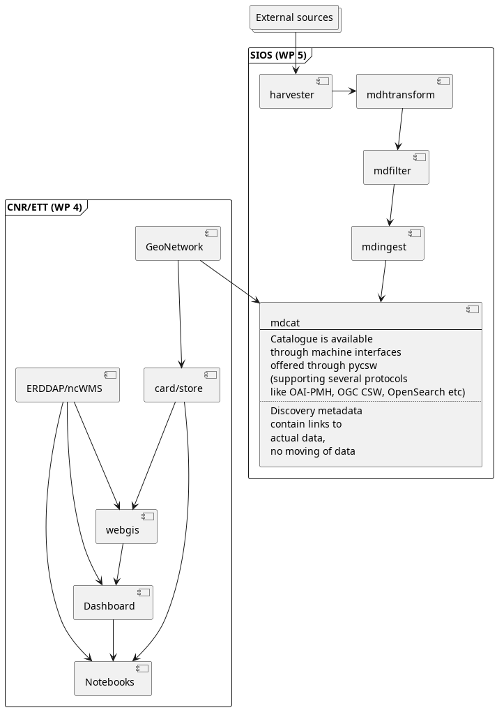

:doctype: article
:pdf-folio-placement: physical
:sectanchors:
:toc: macro
:toclevels: 4
:sectnums:
:sectnumlevels: 6
:chapter-label:
:xrefstyle: short
:title-page:
= Technical documentation: Architecture Design Document

<<<

[discrete]
== Versions

[cols=">1,^2,5,2",]
|===
|Version |Date |Comment |Responsible
|0.1 |2024-??-?? |???. |Øystein Godøy
|===

This work is released under the Creative Commons Attribution 4.0 License. To view a copy of the license, visit https://creativecommons.org/licenses/by/4.0/. 

image::pictures/ccby.png[]

<<<

toc::[]

<<<

== Introduction

=== Background

// Copied from website...
POLARIN is an international network of polar research infrastructures and their services, aiming at addressing the scientific challenges of the polar regions. 
The network includes a wide array of complementary and interdisciplinary top level research infrastructures: Arctic and Antarctic research stations, research vessels and icebreakers operating at both poles, observatories, data infrastructures and ice and sediment core repositories.

POLARIN will provide integrated, challenge-driven, and combined access to these infrastructures to facilitate interdisciplinary research on complex processes.
POLARIN has the following six specific objectives, coherent with the work packages, each with measurable outcomes:

. Enable science for understanding and predicting key processes in polar regions.
. Provide efficient challenge-driven transnational access (TA) to top level RIs in the polar regions.
. Improve data services and provide customised data products.
. Provide virtual access (VA) to data and data services.
. Provide training for infrastructure users.
. Advertise RI services and engage RI users. 

=== Scope of document

This document describes the architecture of POLARIN Virtual Access.
It is not an official deliverable of the project, but aims to establish a common foundation for the work in work packages 4 and 5.

NOTE: This document is not a formalised Architecture Document following a formalised approach like RM-ODP (Reference Model for Open Distributed Processing), but rather a lightweight architecture approach.

=== Intended audience

Data and system managers within POLARIN, in particular participants in POLARIN Work Packages 4 and 5, "Improvement of data services and customised data products" and "Provision of virtual access" respectively.

=== Applicable documents

[horizontal]
[[dow]]RD-1:: Description of work as represented by the proposal.
[[ucd]]RD-2:: Use Case Document (in draft version)
[[cd]]RD-3:: Concept document (not available yet)

== Overall concept
An outline of the division of tasks between work package 4 and 5 is provided in <<architecturediagram>>.
This diagram indicates that development of the human front end to the Polarin data catalogue is done within WP 4, while virtual access as such is provided in WP 5.
The latter is done through compilation of the Polarin data catalogue (WP 5).
This catalogue is utilised by the human front end developed in WP 4.
The requirements that the human interface has to fulfil is outlined in <<ucd>>.

NOTE: The front end can add additional sources to the human front end, but will have to check for uniqueness using the identifiers of the datasets found in the Polarin data catalogue.

// Potentially to be moved down and replaced by a more dedicated illustration here.
[[architecturediagram]]
.Architecture diagram

The datasets relevant for Polarin may be hosted in a number of data centres.
Some of these are members of Polarin, while others are not but have been used by research infrastructures/stations for a long period.
All datasets have to be properly tagged with Polarin as a project name.
This information is used to filter out the relevant datasets for Polarin.

NOTE: A minimum discovery metadata profile has been identified and is further described below.

== Detailed architecture

=== Architecture overview

NOTE: Should use <<architecturediagram>> here and create a new above.

=== Data catalogue

FIXME

=== Human frontend

FIXME

== Documentation standards

=== Minimum discovery metadata profile
A list of generic elements is provided in <<discoverymetadataprofile>>, together with a high level explanation. In <<discoverymetadatamapping>> a suggested mapping between the metadata elements and commonly used metadata
standards is provided.

NOTE: It is expected that a number of metadata standards has to be supported, including various profiles of ISO-19115, schema.org (preferably ESIP's science on schema.org), GCMD DIF, STAC etc.

[[discoverymetadataprofile]]
.A minimum discovery metadata profile has been defined.
[%header, cols="1,4", header=True]
|===
|Element
|Purpose

|Metadata identifier
|A unique identifier for the dataset. 
This is used to avoid duplicate records in aggregator catalogues.
Utilisation of UUID with a namespace prefix is recommended.

|Last update of metadata
|An ISO8601 datetime for the last update of the metadata record.

|Title
|To provide a brief explanatory title for the dataset

|Abstract
|A short summary of the dataset, its purpose and how it was generated.

|Temporal Extent
|The temporal spanning of the dataset. 
This can be a multi temporal dataset.

|Geographical Extent
|The geographical location of the dataset.
This can be a point, a bounding box, trajectory or a polygon.

|Keywords
|Keywords describing the dataset.
Ideally this comes from controlled vocabularies and describes the variables of the dataset. 

|Personnel
|Identification of all people that have contributed to the dataset.
This requires full name, email, affiliation and a role description in the dataset.
The latter has to come from a controlled vocabulary.

|Publisher
|This is identification of the data centre publishing the data.
It contains a long and short name for the data centre and URL to the landing page.

|Use constraint
|This is a license for the data.
This is a URL to the license text and an identifier.
Utilisation of SPDX is recommended.

|Data Access
|This provides direct access to the dataset for download etc. 
It is not a landing page, but a direct link to the data and indication using a controlled vocabulary of the access mechanism (ranging from direct download to OPeNDAP and OGC WMS).

|Project
|A list of projects that has contributed to the creation of the dataset.
Polarin has to be one of the projects.

|===

[[discoverymetadatamapping]]
.A suggested mapping between the elements of the minimum discovery metadata profile and some commonly used metadata standards.
[%header, cols="1,2,1,1,1,1", header=True]
|===
| Metadata field +
(<<discoverymetadataprofile>>)
| ISO-19115 +
(https://standards.iso.org/iso/19139/[ISO-19139], https://standards.iso.org/iso/19115[ISO-19115])
| DIF 10.2 +
(https://git.earthdata.nasa.gov/projects/EMFD/repos/dif-schemas/browse/10.x/dif_v10.2.xsd[DIF-10.2])
| Schema.org +
(https://schema.org/Dataset[Schema.org])
| DCAT +
(https://www.w3.org/TR/vocab-dcat-2/[DCAT-2.0])
| ACDD +
(https://wiki.esipfed.org/Attribute_Convention_for_Data_Discovery_1-3[ACDD])

| Metadata identifier
| gmd:fileIdentifier
| Entry_ID
| identifier
| dct:identifier
| id

| Last update of metadata
| gmd:dateStamp
| Metadata_Dates/Metadata_Last_Revision
| dateModified
| dct:modified
| date_metadata_modified

| Title
| gmd:identificationInfo/gmd:MD_DataIdentification/gmd:citation/gmd:CI_Citation/gmd:title
| Entry_Title
| name
| dct:title
| title

| Abstract
| gmd:identificationInfo/gmd:MD_DataIdentification/gmd:abstract
| Summary/Abstract
| description
| dct:description
| summary

| Temporal Extent
| gmd:identificationInfo/gmd:MD_DataIdentification/gmd:extent/gmd:EX_Extent/gmd:temporalElement/gmd:EX_TemporalExtent/gmd:extent/gml:TimePeriod/gml:beginPosition (gml:endPosition)
| Temporal_Coverage/Range_DateTime/Beginning_Date_Time (Ending_Date_Time)
| temporalCoverage
| dct:temporal
| time_coverage_start and time_coverage_end

| Geographical Extent
| gmd:identificationInfo/gmd:MD_DataIdentification/gmd:extent/gmd:EX_Extent/gmd:geographicElement/gmd:EX_GeographicBoundingBox/gmd:westBoundLongitude (gmd:eastBoundLongitude, gmd:southBoundLatitude, gmd:northBoundLatitude)
| Spatial_Coverage/Geometry/Bounding_Rectangle/Westernmost_Longitude (Northernmost_Latitude, Southernmost_Latitude, Easternmost_Longitude)
| spatialCoverage
| dct:spatial
| geospatial_lat_min,geospatial_lat_max, geospatial_lon_min,geospatial_lon_max

| Keywords
| gmd:identificationInfo/gmd:MD_DataIdentification/gmd:descriptiveKeywords/gmd:MD_Keywords/gmd:keyword (and gmd:identificationInfo/gmd:MD_DataIdentification/gmd:descriptiveKeywords/gmd:MD_Keywords/gmd:thesaurusName/gmd:CI_Citation/gmd:title)
| Science_Keywords for GCMD Science Keywords (or Ancillary_Keyword for free text)
| keywords
| dcat:theme (or dcat:keyword for free text)
| keywords, keywords_vocabulary

| Personnel
| gmd:identificationInfo/gmd:MD_DataIdentification/gmd:pointOfContact/gmd:CI_ResponsibleParty/gmd:individualName (gmd:organisationName, gmd:contactInfo and gmd:role)
| Personnel/Role and Personnel/Contact_Person/First_Name (Last_Name, Email)
| creator, contributor
| dcat:contactPoint, dct:creator
| creator_email, creator_institution, creator_name, creator_type, creator_url, contributor_name, contributor_role

| Publisher
| gmd:distributionInfo/gmd:MD_Distribution/gmd:distributor/gmd:MD_Distributor/gmd:distributorContact
| Organization/Organization_Name/Short_Name (Long_Name) and Organization/Organization_URL
| publisher
| dct:publisher
| publisher_name, publisher_email, publisher_institution, publisher_type, publisher_url

| Use constraint
| gmd:identificationInfo/gmd:MD_DataIdentification/gmd:resourceConstraints/gmd:MD_LegalConstraints/gmd:useConstraints (type=otherRestrictions) and gmd:identificationInfo/gmd:MD_DataIdentification/gmd:resourceConstraints/gmd:MD_LegalConstraints/gmd:otherConstraints
| Use_Constraints
| license
| dct:license
| license

| Data Access
| gmd:distributionInfo/gmd:MD_Distribution/gmd:transferOptions/gmd:MD_DigitalTransferOptions/gmd:onLine/gmd:CI_OnlineResource/gmd:linkage (and gmd:protocol)
| Related_URL/URL_Content_Type/Type and Related_URL/URL
| Distribution  and Distribution/contentUrl
| dcat:distribution (dcat:downloadURL and dcat:accessService)
| TBD

| Project
| can be providede through keywords using "project" as gmd:MD_KeywordTypeCode
| Project/Short_Name (and Long_Name)
| funding
| TBD
| project

|===

=== Data documentation standards

Polarin is recommending usage of Darwin Core Archives and CF-NetCDF for documentation of datasets.

NOTE: Further details to be clarified.

FIXME

Darwin Core Archive:: Is suitable for...
CF-NetCDF:: Is suitable for...

NOTE: Data that doesn't fit into the classes above should be accompanied by a detailed documentation in PDF format.

=== Exchange of discovery metadata

FIXME
